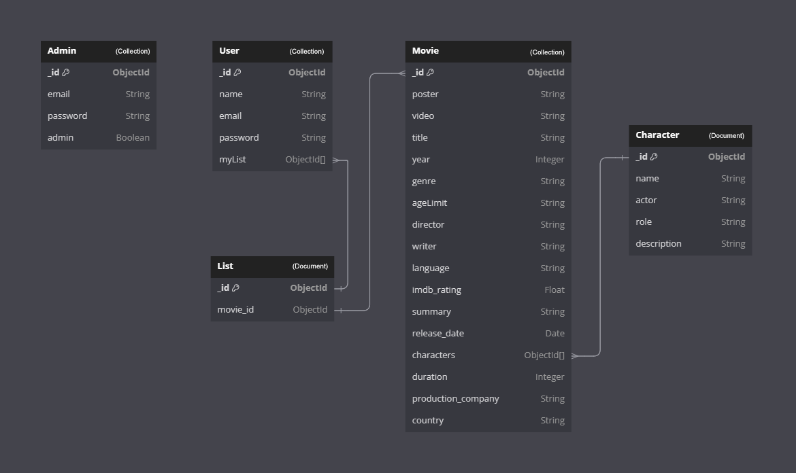

# Veritabanı Diyagramı



## Kullanılması planlanan veritabanı şemaları:

<br/>

Admin için örnek veritabanı diyagramı:
```
{
    "_id": "********",
    "name": "Ali Mutlu",
    "nickname": "alimutlu",
    "salt": "**************************************",
    "hash": "**************************************************************************************************"
}
```
<br/>

Kullanıcı için örnek veritabanı diyagramı:
```
{
    "_id": "*****************************",
    "favMovies": [
        {
            "favMovie": "*********************",
            "_id": "**********************"
        }
    ],
    "likeMovies": [
        {
            "likeMovie": "**********************",
            "_id": "**********************"
        }
    ],
    "name": "Ali Happy",
    "email": "ali@ali.ali",
    "salt": "*******************************************",
    "hash": "**************************************************************************************************************"
    }
}
```
<br/>

"Aşk Tesadüfleri Sever" isimli film için örnek veritabanı diyagramı:
```
{
    "_id": "************",
    "posterURL": "**********",
    "videoURL": "****************",
    "name": "Aşk Tesadüfleri Sever",
    "category": "Romantizm",
    "productionYear": "2011",
    "imdbScore": 7.2,
    "duration": "2sa 3dk",
    "screenwriter": "Nuran Evren Şit",
    "director": "Ömer Faruk Sorak",
    "producer": "Oğuz Peri",
    "language": "Türkçe",
    "ageLimit": "16+",
    "characters": [
        {
            "name": "Özgür",
            "actor": "Mehmet Günsür",
            "_id": "**********"
        },
        {
            "name": "Deniz",
            "actor": "Belçim Bilgin",
            "_id": "**********"
        }
    ],
    "description": "Çocukluk ve ilk gençlik yılları boyunca yolları Ankara’da kesişen ve 2010 yılında İstanbul’da tanışan Özgür (Mehmet Günsür) ve Deniz (Belçim Bilgin), kendilerini engellerle dolu aşk macerasının içinde bulurlar.",
    "isSeries": false,
    "episodes": [],
}
```

<br/>
<br/>

[README'ye dön](../README.md) 

