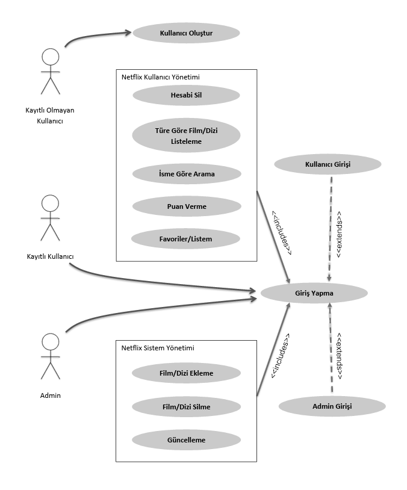

# Durum Diyagramı

### 1. Kullanıcı Girişi Yapılmış Durum
1. Hesabı Sil
2. Türe Göre Film/Dizi Listeleme
3. İsme Göre Arama
4. Puan Verme
5. Favoriler/Listem

### 2. Kullanıcı Girişi Yapılmamış Durum
1. Kullanıcı Oluştur

### 3. Admin Panel
1. Film/Dizi Ekleme
2. Film/Dizi Silme
3. Film/Dizi Güncelleme

 
 

## Geçişler

• *Giriş Yapılmamış Durum → Giriş Yapılmış Durum (Netflix Kullanıcı Yönetimi İşlemleri)* (Kullanıcı giriş yaptığında)  
• *Giriş Yapılmış Durum → Giriş Yapılmamış Durum* (Kullanıcı çıkış yaptığında)  
• *Giriş Yapılmamış Durum → Giriş Yapılmış Durum (Netflix Sistem Yönetimi İşlemleri)* (Admin giriş yaptığında)  
• *Giriş Yapılmış Durum → Giriş Yapılmamış Durum* (Admin çıkış yaptığında)

 
 

[README'ye dön](../README.md) 