### API - Movie
<b>Get Movie :</b> localhost:3000/api/movies/6647651eeeb859d7693da9f8  
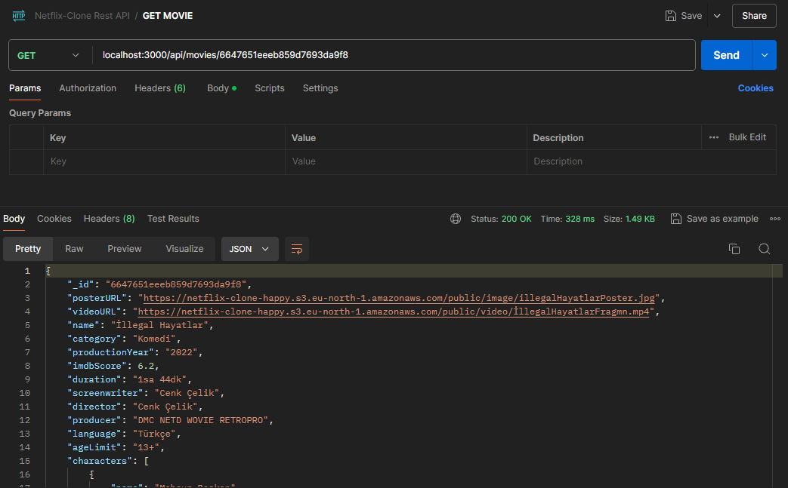

 

<b>All Movie :</b> localhost:3000/api/movies  
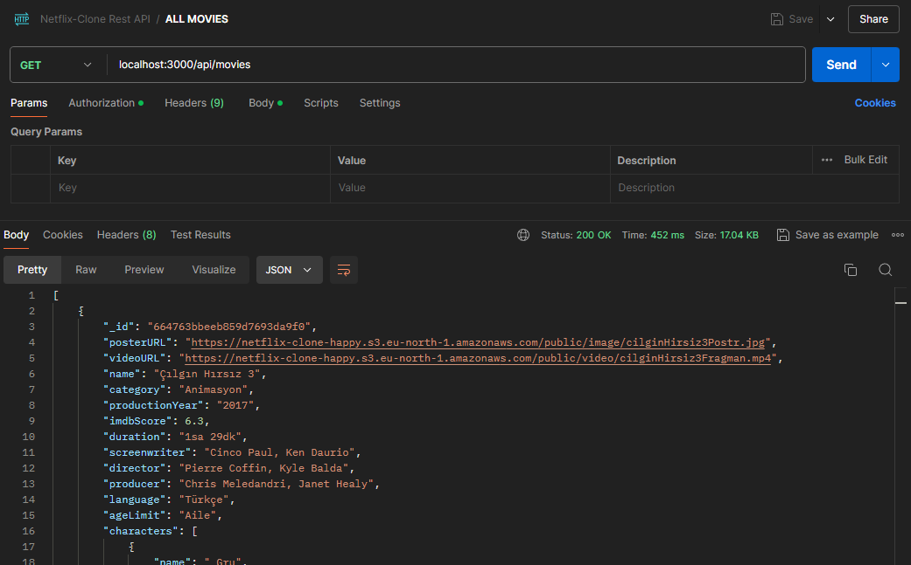

 

<b>Category Movie :</b> localhost:3000/api/movies/category/Romantizm  
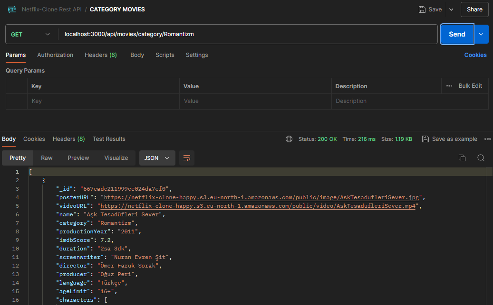

 

<b>Add Movie :</b> localhost:3000/api/ctrlMovie/addmovie  
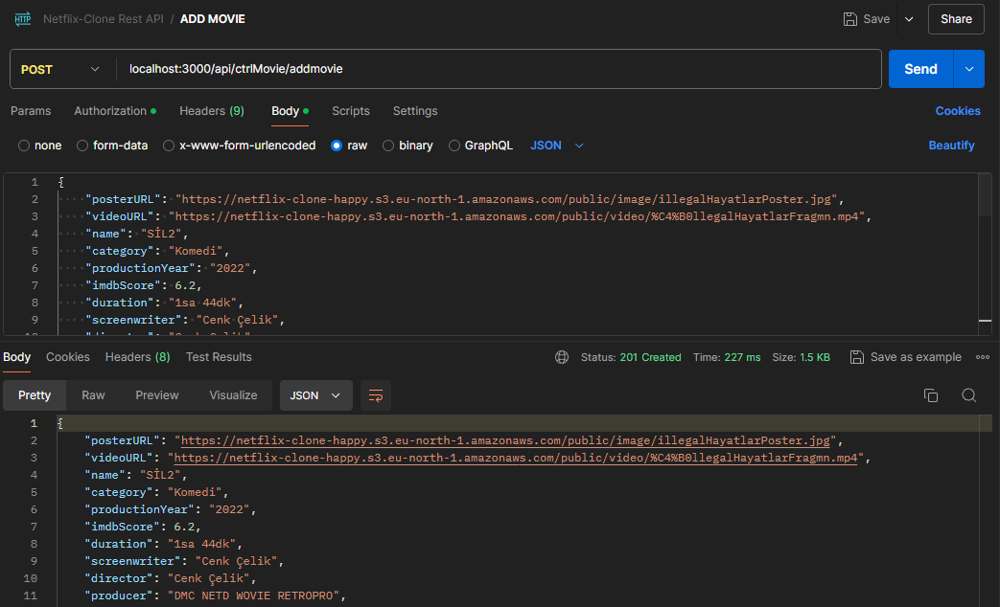

 

<b>Update Movie :</b> localhost:3000/api/ctrlMovie/movies/667ef9b197e906f5d82a52d8  

 

<b>Delete Movie :</b> localhost:3000/api/ctrlMovie/movies/667ef9b197e906f5d82a52d8  
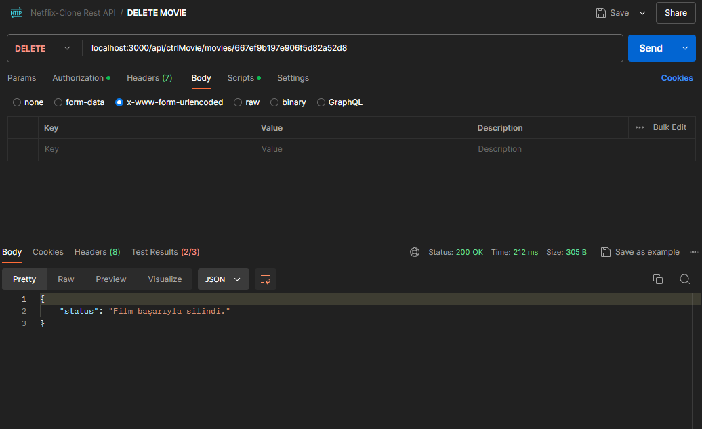

 
 
 

### API - User

<b>Login :</b> localhost:3000/api/login  
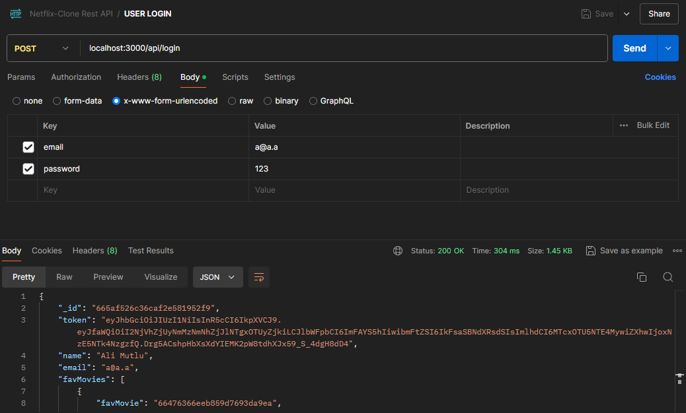

 

<b>Signup :</b> localhost:3000/api/signup  
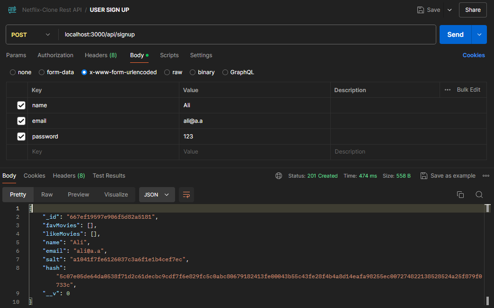

 

<b>Update :</b> localhost:3000/api/user/665af526c36caf2e581952f9  
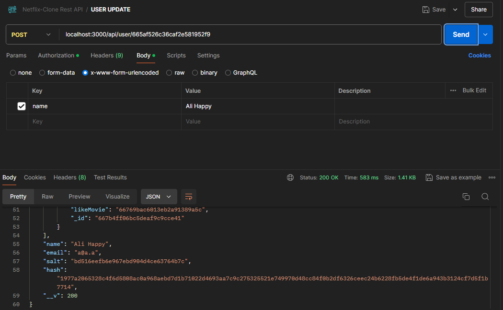

 

<b>Delete :</b> localhost:3000/api/user/665af526c36caf2e581952f9  
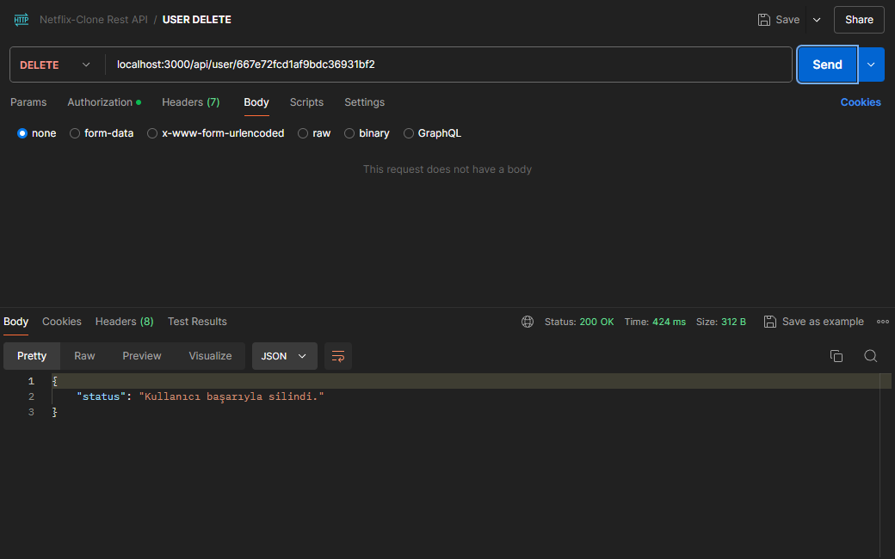

 

<b>Add Favorite Movie :</b> localhost:3000/api/user/665af526c36caf2e581952f9/toggle-fav-movie  
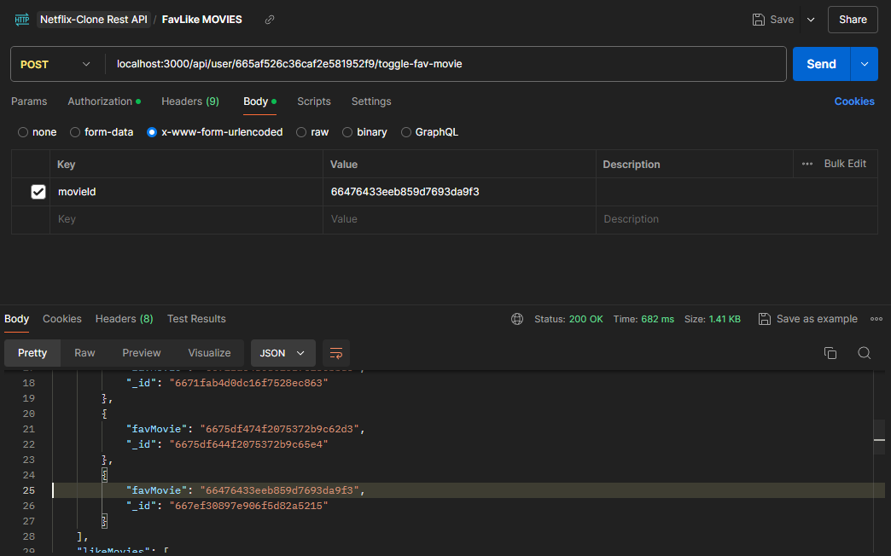

 

<b>Add Like Movie :</b> localhost:3000/api/user/665af526c36caf2e581952f9/toggle-like-movie  
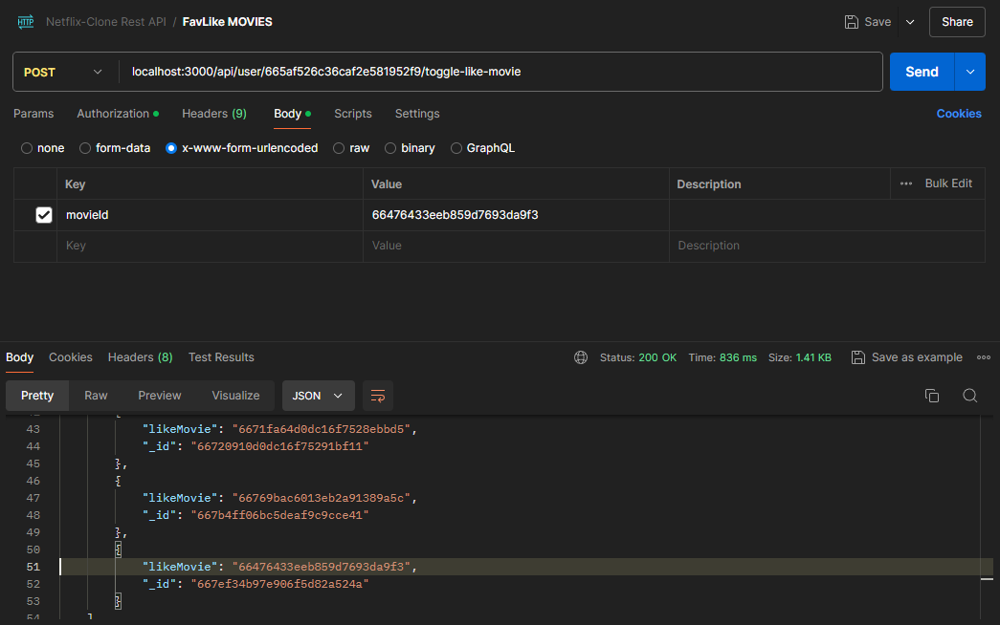

 
 
 

### API - Admin 
<b>Signup :</b> localhost:3000/api/admin/signup  
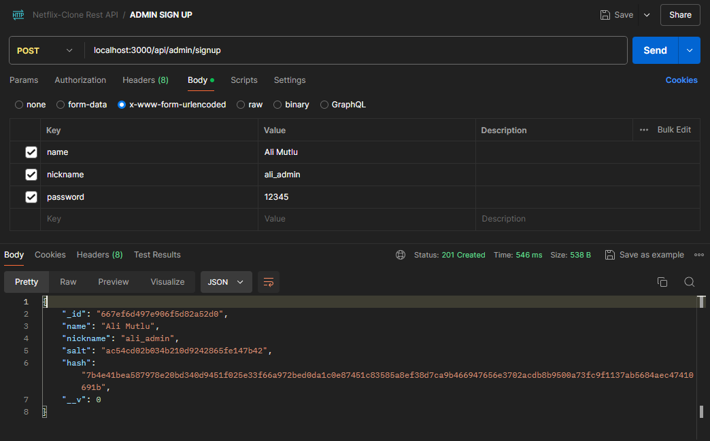

 

<b>Login :</b> localhost:3000/api/admin/login  

<b>Update :</b> localhost:3000/api/admin/667ef6d497e906f5d82a52d0  
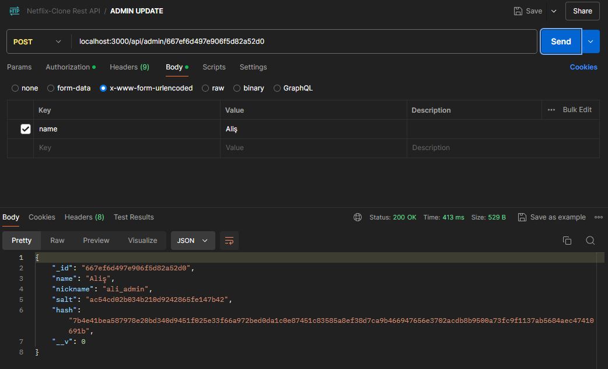

<b>Delete :</b> localhost:3000/api/admin/667ef6d497e906f5d82a52d0  
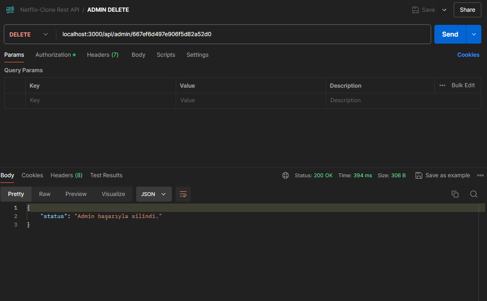

 
 

[README'ye dön](../README.md) 